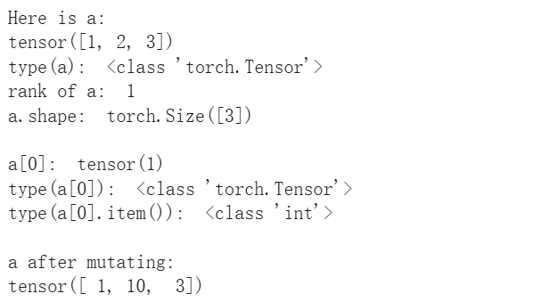
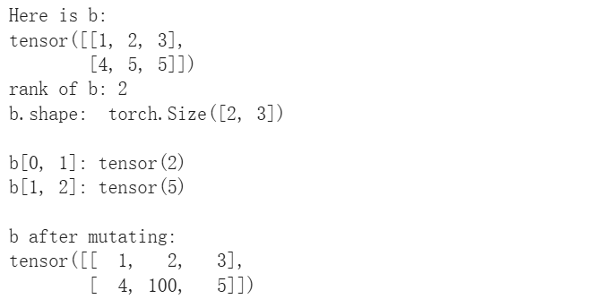
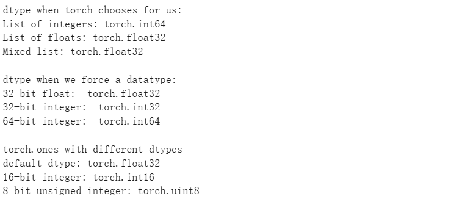
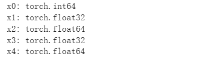
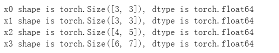

# Python

## 1. 变量与基本类型

```
x = 10          # int
y = 3.14        # float
name = "Tom"    # str
flag = True     # bool
```

类型转换：

```
int("123")
float("1.23")
str(100)
bool(0)      # False
```

注意：Python 没有 i++，使用：

```
i += 1
```

------

## 2. 输入输出

```
x = input("请输入：")     # 得到的是 str
x = int(x)               # 转成数字
print("结果是", x)
```

格式化输出（重要）：

```
print(f"{name} 的分数是 {score}")
```

------

## 3. 条件语句 if / elif / else

```
x = 5

if x > 10:
    print("大")
elif x == 5:
    print("等于 5")
else:
    print("小")
```

注意缩进 = 4 个空格。

------

## 4. 循环 for / while

### for 循环

```
for i in range(5):     # 0,1,2,3,4
    print(i)

for i in range(2, 8, 2):  # 从 2 到 7 步长 2
    print(i)
```

### while 循环

```
i = 0
while i < 5:
    print(i)
    i += 1
```

------

## 5.  列表 list

```
a = [1, 2, 3]
a.append(4)
a.insert(1, 10)
a.remove(2)
x = a[0]
```

遍历：

```
for x in a:
    print(x)
```

切片：

```
b = a[1:3]   # 从 index 1 到 2
```

------

## 6. 字典 dict（键值对）

```
d = {"name": "Tom", "age": 20}
print(d["name"])       # Tom
d["age"] = 21
d["gender"] = "M"
```

遍历：

```
for key, value in d.items():
    print(key, value)
```

------

## 7. 函数 function

```
def add(a, b):
    return a + b

print(add(3, 5))
```

默认参数：

```
def hello(name="Tom"):
    print("Hi", name)
```

------

## 8. 元组 tuple（不可变）

```
t = (1, 2, 3)
x = t[0]
```

------

## 9. 集合 set（不重复）

```
s = {1, 2, 3}
s.add(4)
s.remove(2)
```

------

## 10. 字符串操作

```
s = "hello world"

len(s)
s.upper()
s.lower()
s.split(" ")
s.replace("world", "python")
```

子串：

```
s[0:5]
```

------

## 11. 异常处理 try/except

```
try:
    x = int(input("输入数字："))
except:
    print("输入错误")
```

------

## 12. 文件读写

写文件：

```
with open("data.txt", "w") as f:
    f.write("hello")
```

读文件：

```
with open("data.txt", "r") as f:
    text = f.read()
```

------

## 13.  类 class (for oop)

```
class Person:
    def __init__(self, name, age):
        self.name = name
        self.age = age

    def say(self):
        print(f"I am {self.name}")

p = Person("Tom", 20)
p.say()
```

注意：
 **self 必须写，是对象本身。**


-----

# Pytorch

[PyTorch](https://www.google.com/url?q=https%3A%2F%2Fpytorch.org%2F) is an open source machine learning framework. At its core, PyTorch provides a few key features:

- A multidimensional **Tensor** object, similar to [numpy](https://www.google.com/url?q=https%3A%2F%2Fnumpy.org%2F) but with GPU accelleration.
- **自动求导**：An optimized **autograd** engine for automatically computing derivatives
- A clean, modular API for building and deploying **deep learning models**

 This notebook will focus on the **Tensor API**, as it is the main part of PyTorch that we will use for the first few assignments.

- You can find more information about PyTorch by following one of the [official tutorials](https://www.google.com/url?q=https%3A%2F%2Fpytorch.org%2Ftutorials%2F) or by [reading the documentation](https://www.google.com/url?q=https%3A%2F%2Fpytorch.org%2Fdocs%2Fstable%2F).

## What is Tensor?

A `torch` **tensor** is a multidimensional grid of values, all of the same type, and is indexed by a tuple of nonnegative integers. 

- The *number of dimensions* is the **rank** of the tensor; 
- the **shape** of a tensor is a *tuple* of integers giving the size of the array along each dimension.

See **pytorch101.ipynb** in UMich EECS

```python
import torch
print(torch.__version__)
```

## 1. Create and access tensor

### （1）basic ways

We can initialize `torch` tensor from nested Python lists. We can access or mutate elements of a PyTorch tensor using square brackets`[]`.

Accessing an element from a PyTorch tensor returns a **PyTorch scalar**(标量); we can convert this to a Python scalar using the `.item()` method

```python
# Create a rank 1 tensor from a Python list
a = torch.tensor([1, 2, 3])
print('Here is a:')
print(a)
print('type(a): ', type(a))
print('rank of a: ', a.dim())
print('a.shape: ', a.shape)

# Access elements using square brackets
print()
print('a[0]: ', a[0])
print('type(a[0]): ', type(a[0]))
print('type(a[0].item()): ', type(a[0].item()))

# Mutate elements using square brackets
a[1] = 10
print()
print('a after mutating:')
print(a)
```

> 

```python
# Create a two-dimensional tensor
b = torch.tensor([[1, 2, 3], [4, 5, 5]])
print('Here is b:')
print(b)
print('rank of b:', b.dim())
print('b.shape: ', b.shape)

# Access elements from a multidimensional tensor
print()
print('b[0, 1]:', b[0, 1])
print('b[1, 2]:', b[1, 2])

# Mutate elements of a multidimensional tensor
b[1, 1] = 100
print()
print('b after mutating:')
print(b)
```

> 

### （2）Easy ways for construction

PyTorch provides many convenience methods for constructing tensors; this avoids the need to use Python lists, which can be inefficient when manipulating large amounts of data. Some of the most commonly used tensor constructors are:

- [`torch.zeros`](https://www.google.com/url?q=https%3A%2F%2Fpytorch.org%2Fdocs%2Fstable%2Fgenerated%2Ftorch.zeros.html): Creates a tensor of all zeros
- [`torch.ones`](https://www.google.com/url?q=https%3A%2F%2Fpytorch.org%2Fdocs%2Fstable%2Fgenerated%2Ftorch.ones.html): Creates a tensor of all ones
- [`torch.rand`](https://www.google.com/url?q=https%3A%2F%2Fpytorch.org%2Fdocs%2Fstable%2Fgenerated%2Ftorch.rand.html): Creates a tensor with uniform random numbers

You can find a full list of tensor creation operations [in the documentation](https://www.google.com/url?q=https%3A%2F%2Fpytorch.org%2Fdocs%2Fstable%2Ftorch.html%23creation-ops).

```python
# Create a tensor of all zeros
a = torch.zeros(2, 3)
print('tensor of zeros:')
print(a)

# Create a tensor of all ones
b = torch.ones(1, 2)
print('\ntensor of ones:')
print(b)
#所以，我们也可以用常数*ones的方式来快速创造特殊的矩阵

# Create a 3x3 identity matrix
c = torch.eye(3) #对角全1矩阵
print('\nidentity matrix:')
print(c)

# Tensor of random values
d = torch.rand(4, 5)
print('\nrandom tensor:')
print(d)
```

### （3）Datatypes

In the examples above, you may have noticed that some of our tensors contained floating-point values, while others contained integer values.

- PyTorch provides a [large set of numeric datatypes](https://www.google.com/url?q=https%3A%2F%2Fpytorch.org%2Fdocs%2Fstable%2Ftensor_attributes.html%23torch.torch.dtype) that you can use to construct tensors. 

PyTorch tries to *guess* a datatype when you create a tensor; functions that construct tensors typically have a `dtype` argument that you can use to explicitly specify a datatype.

Each tensor has a `dtype` attribute that you can use to check its data type:

```python
# Let torch choose the datatype
x0 = torch.tensor([1, 2])   # List of integers
x1 = torch.tensor([1., 2.]) # List of floats
x2 = torch.tensor([1., 2])  # Mixed list
print('dtype when torch chooses for us:')
print('List of integers:', x0.dtype)
print('List of floats:', x1.dtype)
print('Mixed list:', x2.dtype)

# Force a particular datatype
y0 = torch.tensor([1, 2], dtype=torch.float32)  # 32-bit float
y1 = torch.tensor([1, 2], dtype=torch.int32)    # 32-bit (signed) integer
y2 = torch.tensor([1, 2], dtype=torch.int64)    # 64-bit (signed) integer
print('\ndtype when we force a datatype:')
print('32-bit float: ', y0.dtype)
print('32-bit integer: ', y1.dtype)
print('64-bit integer: ', y2.dtype)

# Other creation ops also take a dtype argument
z0 = torch.ones(1, 2)  # Let torch choose for us
z1 = torch.ones(1, 2, dtype=torch.int16) # 16-bit (signed) integer
z2 = torch.ones(1, 2, dtype=torch.uint8) # 8-bit (unsigned) integer
print('\ntorch.ones with different dtypes')
print('default dtype:', z0.dtype)
print('16-bit integer:', z1.dtype)
print('8-bit unsigned integer:', z2.dtype)
```

> 

We can **cast** a tensor to another datatype using the [`.to()`](https://www.google.com/url?q=https%3A%2F%2Fpytorch.org%2Fdocs%2Fstable%2Fgenerated%2Ftorch.Tensor.to.html) method; there are also convenience methods like [`.float()`](https://www.google.com/url?q=https%3A%2F%2Fpytorch.org%2Fdocs%2Fstable%2Fgenerated%2Ftorch.Tensor.float.html) and [`.long()`](https://www.google.com/url?q=https%3A%2F%2Fpytorch.org%2Fdocs%2Fstable%2Fgenerated%2Ftorch.Tensor.long.html) that cast to particular datatypes:

```python
x0 = torch.eye(3, dtype=torch.int64)
x1 = x0.float()  # Cast to 32-bit float
x2 = x0.double() # Cast to 64-bit float
x3 = x0.to(torch.float32) # Alternate way to cast to 32-bit float
x4 = x0.to(torch.float64) # Alternate way to cast to 64-bit float
print('x0:', x0.dtype)
print('x1:', x1.dtype)
print('x2:', x2.dtype)
print('x3:', x3.dtype)
print('x4:', x4.dtype)
```

> 

PyTorch provides several ways to create a tensor with the same datatype as another tensor:

- PyTorch provides tensor constructors such as [`torch.zeros_like()`](https://www.google.com/url?q=https%3A%2F%2Fpytorch.org%2Fdocs%2Fstable%2Fgenerated%2Ftorch.zeros_like.html) that create new tensors with *the same shape and type as a given tensor*
- Tensor objects have instance methods such as [`.new_zeros()`](https://www.google.com/url?q=https%3A%2F%2Fpytorch.org%2Fdocs%2Fstable%2Fgenerated%2Ftorch.Tensor.new_zeros.html) that create tensors the same type but possibly different shapes
- The tensor instance method [`.to()`](https://www.google.com/url?q=https%3A%2F%2Fpytorch.org%2Fdocs%2Fstable%2Fgenerated%2Ftorch.Tensor.to.html) can take a tensor as an argument, in which case it casts to the datatype of the argument.

```python
x0 = torch.eye(3, dtype=torch.float64)  # Shape (3, 3), dtype torch.float64
x1 = torch.zeros_like(x0)               # Shape (3, 3), dtype torch.float64
x2 = x0.new_zeros(4, 5)                 # Shape (4, 5), dtype torch.float64
x3 = torch.ones(6, 7).to(x0)            # Shape (6, 7), dtype torch.float64
print('x0 shape is %r, dtype is %r' % (x0.shape, x0.dtype))
print('x1 shape is %r, dtype is %r' % (x1.shape, x1.dtype))
print('x2 shape is %r, dtype is %r' % (x2.shape, x2.dtype))
print('x3 shape is %r, dtype is %r' % (x3.shape, x3.dtype))
```

> 

Even though PyTorch provides a large number of numeric datatypes, the most commonly used datatypes are:

- `torch.float32`: Standard floating-point type; used to store learnable parameters, network activations, etc. Nearly all arithmetic is done using this type.
- `torch.int64`: Typically used to store indices
- `torch.bool`: Stores boolean values: 0 is false and 1 is true
- `torch.float16`: Used for mixed-precision arithmetic, usually on NVIDIA GPUs with [tensor cores](https://www.google.com/url?q=https%3A%2F%2Fwww.nvidia.com%2Fen-us%2Fdata-center%2Ftensorcore%2F). You won't need to worry about this datatype in this course.

## 2. PyTorch Tensor Cheatpaper

### (1) Tensor 基础属性 (Core Attributes)

这些属性用于查询 Tensor 的基本信息，它们都是 **非 In-place** 的。

| **属性/方法**                | **返回类型**         | **描述**                                           | **示例值**                     |
| ---------------------------- | -------------------- | -------------------------------------------------- | ------------------------------ |
| **`.dtype`**                 | `torch.dtype`        | 张量的数据类型。                                   | `torch.float32`, `torch.int64` |
| **`.device`**                | `torch.device`       | 张量所在的设备。                                   | `cpu`, `cuda:0`                |
| **`.shape`** / **`.size()`** | `torch.Size` (tuple) | 张量的形状和维度大小。                             | `(4, 2, 3)`                    |
| **`.ndim`** / **`.dim()`**   | `int`                | 张量的维度数量 (Rank)。                            | `3`                            |
| **`.item()`**                | Python 标量          | 仅适用于包含单个元素的张量，将其转为 Python 数值。 | `11` (Python int/float)        |

- `0维Tensor / scalar tensor`：

  ```python
  x = torch.tensor([1., 2., 3.])
  s = x.sum()
  print(s)            # tensor(6.)
  print(s.shape)      # torch.Size([])
  ```

  - **与scalar的区别**: 一个 0-维 tensor，其数据完全处于 x 的 device 和 dtype 上；而如果`.item()`化为scalar，会导致dtype不受控(float32 -> float64), device转到CPU，产生负面影响
  - 可以直接写入`多维tensor[i, j,...]  ← 0-维 tensor`

- `一维Tensor`:

  在`vectorization`中，有时候我们试图把整一行都替换成某个tensor，例如将`dist为二维tensor，dist[i]`换成`shape为(j,)的一维行张量`，但经过一系列张量之后我们手头上有的是一个`一维列向量`，那此时我们需不需要将这个列向量`.t()`再赋值进`dist`呢？

  - 答案是不用的。因为`Tensor`概念下，一维张量就是一维张量，**没有行列之分**，所以我们直接赋值就行。而且事实上，如果说真的创造一个`shape为( , j )的tensor`，它其实是二维的而非一维！

------

### (2) **创建与初始化** (Creation & (Initialization))

| **函数**                       | **In-place?** | **返回类型/形状** | **描述**                                          |
| ------------------------------ | ------------- | ----------------- | ------------------------------------------------- |
| `torch.tensor(data)`           | 否            | New Tensor        | torch.tensor(`[[1,2,3][1,2,3][1,2,3]]`)           |
| `torch.zeros(size)`            | 否            | New Tensor (全 0) | 创建指定形状的全 0 张量。                         |
| `torch.zeroes_like(x)`         | 否            | New Tensor (全0)  | 创建与 `x` **形状**和 **dtype** 相同的全 0 张量。 |
| `torch.ones_like(x)`           | 否            | New Tensor        | 创建与 `x` **形状**和 **dtype** 相同的全 1 张量。 |
| `torch.rand(size)`             | 否            | New Tensor        | 创建指定形状的 [0, 1) 均匀分布随机数。            |
| **`torch.arange(start, end)`** | 否            | New Tensor (1D)   | 创建等差数列，类似range                           |
| **`x.clone()`**                | 否            | New Tensor (Copy) | 创建一个**完全独立**的深拷贝。                    |

------

### (3) 形状与维度变换 (Reshaping & Permutation)

| **函数**                      | **In-place?** | **内存关系/返回**   | **典型形状变化**                        | **描述**                              |
| ----------------------------- | ------------- | ------------------- | --------------------------------------- | ------------------------------------- |
| `x.view(new_shape)`           | 否            | **View** (共享数据) | `(M, N, K) -> (M*N, K)`                 | 仅在内存连续时可用。                  |
| **`x.reshape(new_shape)`**    | 否            | **View 或 Copy**    | `(M, N, K) -> (M*N, K)`                 | 自动处理不连续情况，更安全。          |
| `x.t()`                       | 否            | **View**            | $(M, N) \rightarrow (N, M)$             | 仅用于 Rank 2 (矩阵) 转置。           |
| **`x.transpose(dim0, dim1)`** | 否            | **View**            | $(B, C, H, W) \rightarrow (B, H, C, W)$ | 交换两个维度，内存不连续。            |
| `x.permute(*dims)`            | 否            | **View**            | $(0, 1, 2) \rightarrow (2, 0, 1)$       | 按指定顺序重排所有维度。              |
| `x.contiguous()`              | 否            | **Copy**            | 无变化                                  | 强制将张量数据在内存中变为连续。      |
| `x.unsqueeze(dim)`            | 否            | **View**            | $(M, N) \rightarrow (1, M, N)$          | 在指定维度插入一个大小为 1 的新维度。 |

------

### (4) 数学运算与归约 (Math & Reduction)

| **函数**                       | **In-place?**  | **返回类型/形状**           | **描述**                                                     |
| ------------------------------ | -------------- | --------------------------- | ------------------------------------------------------------ |
| `x + y` / `x * y`              | 否             | New Tensor                  | 逐元素运算，支持**广播 (Broadcasting)**。                    |
| `x.add_(y)` / `x.mul_(y)`      | **是** (带`_`) | `x` 自身                    | 逐元素运算的 **In-place** 版本。                             |
| `torch.dot(v, w)`              | 否             | Scalar Tensor (Rank 0)      | 仅用于 1D 向量的点积。                                       |
| `torch.mm(x, y)`               | 否             | New Tensor                  | 仅用于 Rank 2 标准矩阵乘法 ($M \times K$ 和 $K \times N$)。  |
| `x @ y` / `torch.matmul(x, y)` | 否             | New Tensor                  | **矩阵乘法**，支持 1D/2D/3D (批量) 运算。                    |
| `x.sum(dim=None)`              | 否             | scalar tensor 或 New Tensor | 沿指定 `dim` 求和，该维度会被消除。无dim参数则直接生成0维tensor，可以直接赋值进`二维tensor[i][j]` |
| `x.max(dim=None)`              | 否             | Scalar 或 Tuple             | 返回最大值 (及索引 `indices`，如果指定了 `dim`)。            |
| `torch.sqrt(x)`                | 否             | New Tensor                  | 逐元素求平方根。                                             |
| `x.sum(dim, keepdim=True)`     | 否             | New Tensor                  | 归约后保留被消除的维度（大小为 1），利于广播。               |

------

### (5) 索引与赋值 (Indexing & Assignment)

| **索引方式**     | **示例**            | **描述**                                             | **赋值 (In-place)**       |
| ---------------- | ------------------- | ---------------------------------------------------- | ------------------------- |
| **切片索引**     | `x[1:3, 0]`         | 选取连续的子区域。                                   | 支持：`x[:, 0] = 5`       |
| **布尔索引**     | `x[x > 0]`          | 使用布尔掩码选取所有符合条件的元素（返回 1D 向量）。 | 支持：`x[x > 0] = 0`      |
| **整数数组索引** | `x[[0, 1], [2, 3]]` | **一一配对**坐标：选取离散点 `(0, 2)` 和 `(1, 3)`。  | 支持：`x[rows, cols] = 0` |

------

### (6) 设备管理与 GPU (Device Management)

| **函数**                    | **In-place?** | **返回/效果**     | **描述**                                                     |
| --------------------------- | ------------- | ----------------- | ------------------------------------------------------------ |
| `x.to(device)`              | 否            | New Tensor (Copy) | **通用方法**，将张量移动到指定设备（如 `'cuda'`），可同时指定 `dtype`。 |
| `x.cpu()`                   | 否            | New Tensor (Copy) | 快速将张量移回 CPU。                                         |
| `x.cuda()`                  | 否            | New Tensor (Copy) | 快速将张量移到 GPU。                                         |
| `torch.cuda.is_available()` | 否            | `bool`            | 检查环境中是否有可用的 CUDA GPU。                            |
| `torch.cuda.synchronize()`  | 否            | None (等待)       | **强制同步**，使 CPU 等待 GPU 完成所有排队任务（常用于精确计时）。 |
| `torch.device('cuda')`      | 否            | `torch.device`    | 创建设备对象，推荐用于灵活的设备管理。                       |

-----

### （7）Broadcast 广播机制

两个 Tensor 能够广播的**充要条件**是，从它们的**尾部维度 (trailing dimensions)** 开始比较，满足以下任一条件：

1. **维度相等**：两个 Tensor 在该维度的长度相同。
2. **维度为 1**：其中一个 Tensor 在该维度的长度为 1 (可以被拉伸/复制)。
3. **维度缺失**：其中一个 Tensor 已经没有更多的维度了 (可以被视为长度为 1 的维度)

- 例子：二维tensor + 一维tensor

| **操作**                        | **A Shape** | **B/C Shape** | **隐式对齐的 B/C Shape**                                 | **是否成功** | **Result Shape** |
| ------------------------------- | ----------- | ------------- | -------------------------------------------------------- | ------------ | ---------------- |
| **$A + B$**                     | $(i, j)$    | $(i)$         | $(\mathbf{i}, \mathbf{j})$ vs $(\mathbf{1}, \mathbf{i})$ | ❌ 失败       | N/A              |
| **$A + C$**                     | $(i, j)$    | $(j)$         | $(i, j)$ vs $(\mathbf{1}, j)$                            | ✅ 成功       | $(i, j)$         |
| **$A + B.\text{unsqueeze}(1)$** | $(i, j)$    | $(i)$         | $(i, j)$ vs $(i, \mathbf{1})$                            | ✅ 成功       | $(i, j)$         |
| $A + B.view(i,1)$               | $(i, j)$    | $(i)$         | $(i, j)$ vs $(i, \mathbf{1})$                            | ✅ 成功       | $(i, j)$         |

**广播的结果形状 (Result Shape)**：

最终结果 Tensor 的维度数量是两个输入 Tensor 中维度数量的较大值。结果 Tensor 在每个维度上的长度是两个输入 Tensor 在该维度上的长度的较大值。

| **操作类型 (Op Type)**    | **示例 PyTorch 函数**        | **描述**                                          |
| ------------------------- | ---------------------------- | ------------------------------------------------- |
| **加法** (Addition)       | `torch.add(a, b)` 或 `a + b` | 广播 $b$ 的形状以匹配 $a$，然后执行逐元素加法。   |
| **减法** (Subtraction)    | `torch.sub(a, b)` 或 `a - b` | 广播 $b$ 的形状以匹配 $a$，然后执行逐元素减法。   |
| **乘法** (Multiplication) | `torch.mul(a, b)` 或 `a * b` | 广播 $b$ 的形状以匹配 $a$，然后执行逐元素乘法。   |
| **除法** (Division)       | `torch.div(a, b)` 或 `a / b` | 广播 $b$ 的形状以匹配 $a$，然后执行逐元素除法。   |
| **幂运算** (Power)        | `torch.pow(a, b)`            | 广播 $b$ 的形状以匹配 $a$，然后执行逐元素幂运算。 |
| **比较运算** (Comparison) | `torch.gt(a, b)`, `a > b`    | 返回一个布尔型 Tensor，表示逐元素的比较结果。     |
| **逻辑运算** (Logical)    | `torch.logical_and(a, b)`    | 返回逐元素的逻辑 AND/OR/XOR 结果。                |